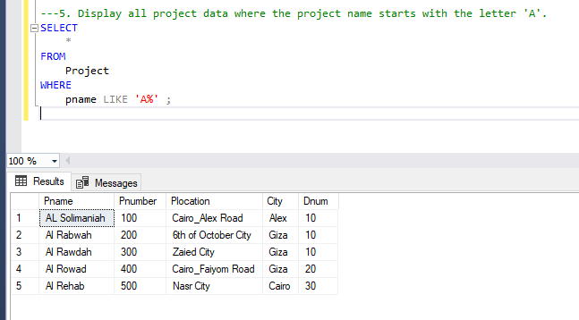

## Task 8 ( Joins Lab ) 
Company Database (the provided database) – JOIN Queries 

1. Display the department ID, department name, manager ID, and the full name of the manager.

2. Display the names of departments and the names of the projects they control. 

3. Display full data of all dependents, along with the full name of the employee they depend on.

4. Display the project ID, name, and location of all projects located in Cairo or Alex. 

5. Display all project data where the project name starts with the letter 'A'. 

6. Display the IDs and names of employees in department 30 with a salary between 1000 and 2000 LE. 

7. Retrieve the names of employees in department 10 who work ≥ 10 hours/week on the "AL Rabwah" project.
 

8. Find the names of employees who are directly supervised by "Kamel Mohamed". 

9. Retrieve the names of employees and the names of the projects they work on, sorted by project name.
..

10. For each project located in Cairo, display the project number, controlling department name, manager's last name, 
address, and birthdate.

	
	

